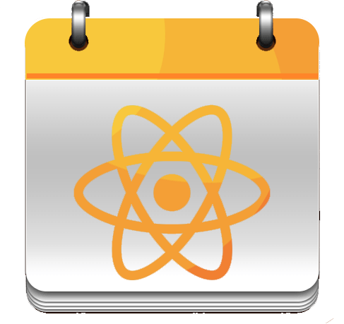

<p align="center">
  
</p>

# React Polygon Particles Image
Image component with polygon particles

<p align="center">
  
</p>

## Installation
Run the following command:
`npm install --save react-polygon-particles-image`

## Usage

```js
import ParticlesImage from 'react-polygon-particles-image'

const MyComponent = props => (
  <div>
    <ParticlesImage 
        style={{width: '96%', margin: '1rem 2%'}}
        backgroundImage={"https://cdn.pixabay.com/photo/2016/04/15/04/02/water-1330252_1280.jpg"}
        particlesAmount={50}
        particlesSize={20}
        title="Polygon Particles Image"
        subtitle="A React library for Polygon Particles Image creation"
        subtitleStyle={{fontSize: '1.6rem', marginTop: '0.5rem'}}
        onHeaderClick={() => {}}
    />
  </div>
)

```

## Properties

| Props | Default Values | Descriptions |
| --- | --- | --- |
| style | none | Component container styles |
| particlesAmount | 20 | number of particles |
| particlesSize | 10 | particles size |
| particlesColor | '#ffffff | particles color |
| particlesPolygonSides | 3 | particles polygon sides |
| particlesSpeed | 10 | particles speed |
| title | '' | Image title |
| titleStyle | {} | Image title styles |
| subtitle | '' | Image subtitle |
| subtitleStyle | {} | Image subtitle styles |
| headerWidth | '100%' | Header 2idth |
| headerHeight | '20rem' | Header height |
| onHeaderClick | none | On image click action |
